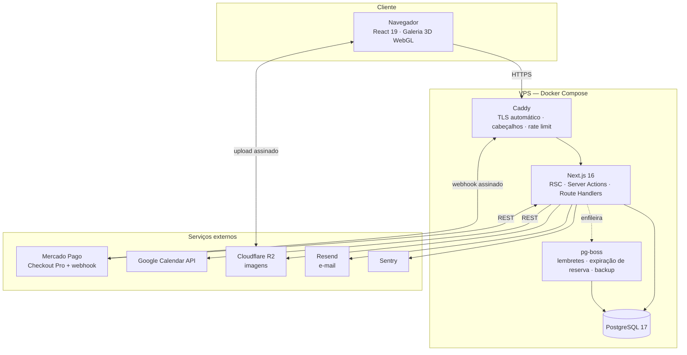

# Kolô — Escopo do Produto e Stack Recomendada (TCC 2)

> **O que é este documento.** Consolidação revisada do escopo funcional e da decisão técnica para a
> construção do sistema. Substitui, para fins de desenvolvimento, os capítulos 4 (Requisitos e
> Tecnologias) e 5 (Modelagem e Arquitetura) do `TCC.md`, que foram escritos com apoio intensivo de IA
> e contêm imprecisões técnicas, requisitos incompletos e escolhas tecnológicas sem critério explícito.
>
> **Versão:** 1.0 · **Data:** agosto de 2026 · **Fase:** TCC 2 — implementação
> **Equipe:** Caio Scorsoni, Caio Vinicius, Guilherme Salustiano, Gustavo Magalhães, Robert Estevan

---

## Sumário

1. [Contexto atualizado](#1-contexto-atualizado)
2. [O que precisa ser corrigido no TCC 1](#2-o-que-precisa-ser-corrigido-no-tcc-1)
3. [Decisões de escopo](#3-decisões-de-escopo)
4. [Visão do produto](#4-visão-do-produto)
5. [Features completas por módulo](#5-features-completas-por-módulo)
6. [Requisitos não funcionais](#6-requisitos-não-funcionais)
7. [Regras de negócio](#7-regras-de-negócio)
8. [Papéis e permissões](#8-papéis-e-permissões)
9. [Stack recomendada](#9-stack-recomendada)
10. [Por que não React + Laravel + MySQL](#10-por-que-não-react--laravel--mysql)
11. [Alternativas consideradas](#11-alternativas-consideradas)
12. [Arquitetura](#12-arquitetura)
13. [Modelo de dados](#13-modelo-de-dados)
14. [Integrações externas](#14-integrações-externas)
15. [Infraestrutura e deploy](#15-infraestrutura-e-deploy)
16. [Qualidade e testes](#16-qualidade-e-testes)
17. [Cronograma de 8 semanas](#17-cronograma-de-8-semanas)
18. [Riscos e mitigações](#18-riscos-e-mitigações)
19. [Fora de escopo](#19-fora-de-escopo)
20. [Pendências com o cliente](#20-pendências-com-o-cliente)

---

## 1. Contexto atualizado

O Kolô é um ateliê e estúdio de tatuagem que integra artistas plásticos, tatuadores residentes e a
comunidade artística. Sua tração vem da presença no Instagram, mas a operação é manual: vendas
controladas fora de sistema, ausência de catálogo consultável, agendamentos negociados um a um em
conversas e nenhum histórico estruturado de clientes.

**Mudança relevante desde o TCC 1: o Kolô não tem mais o espaço físico em Pinheiros.**

Isso não enfraquece o projeto — fortalece. No TCC 1, a galeria 3D era apresentada como um
"diferencial imersivo" opcional, o que é uma justificativa fraca. Agora ela assume função estrutural:
**a galeria virtual passa a ser o espaço de exposição do ateliê**, substituindo a sala que deixou de
existir. O argumento para a banca deixa de ser estético e passa a ser funcional — a tecnologia resolve
a perda de um ativo do negócio.

Consequências diretas no escopo:

- **Entra:** galeria 3D navegável, com curadoria de paredes/salas pelo administrador.
- **Sai:** tour virtual 360° por fotografia panorâmica (não há mais espaço para fotografar).
- **Reforça:** e-commerce e agendamento passam a ser o único canal de operação, não um complemento
  ao atendimento presencial.

O problema de pesquisa permanece válido e pode ser reforçado assim: *como uma plataforma web dedicada
pode absorver a operação de um ateliê que perdeu seu espaço físico, sustentando exposição, venda de
obras e agendamento de tatuagens de forma integrada e assíncrona?*

---

## 2. O que precisa ser corrigido no TCC 1

Checklist de revisão do `TCC.md` antes da entrega final. São problemas de rigor, não de conteúdo —
a tese é boa, a redação e o embasamento técnico precisam de correção.

### Erros factuais e técnicos

| # | Onde | Problema | Correção |
|---|------|----------|----------|
| 1 | 4.5 Tecnologias | "Nginx (...) permite segurança contra ataques de XSS e SQL Injection através da configuração manual de um único arquivo" | **Tecnicamente incorreto.** Proxy reverso não protege contra XSS nem SQL Injection. XSS se previne com escape/CSP na camada de apresentação; SQL Injection, com consultas parametrizadas/ORM. O proxy cuida de TLS, roteamento, cabeçalhos e limitação de taxa. |
| 2 | 4.3 RNF02 | "O sistema deve utilizar uma versão de PHP que receba atualizações de segurança" | Requisito não funcional **não deve engessar a linguagem**. Reescrever de forma agnóstica: "o runtime e as dependências devem estar em versões com suporte ativo de segurança". |
| 3 | 2.3 / 4.6 / 5.1 | Defende monolito citando Sommerville, mas usa Newman (*Building Microservices*) para justificar REST e descreve front e back separados | Manter a decisão de monolito (correta), mas nomeá-la corretamente: **monolito modular**. Usar Fielding para REST; Newman só se for para contrastar com a alternativa descartada. |
| 4 | Cap. 3 | O cliente é chamado de "Kalo Ateliê" | Padronizar como **Kolô** em todo o documento. |
| 5 | 3.3 e 3.4 | Duas seções com o mesmo título "Definição de Requisito"; a 3.4 fala de metodologia ágil | Renomear 3.4 para "Metodologia de Desenvolvimento (Scrum)". |
| 6 | Cap. 7 | Pressman & Maxim (2021) aparece duplicado nas referências | Remover a duplicata; conferir também LAUDON & TRAVER fora de ordem alfabética. |
| 7 | Cap. 7 | Prodanov & Freitas com edição quebrada ("- ed.") | Corrigir para "2. ed." |

### Descolamento entre teoria, resumo e requisitos

| Prometido no texto | Está nos RF? | Ação |
|--------------------|--------------|------|
| Galeria 3D (2.2) | Não | Virou **RF15–RF19** neste documento |
| Tour virtual 360° (2.2) | Não | **Removido** — sem espaço físico |
| E-commerce, carrinho, checkout, Mercado Pago (Resumo, 2.4) | Não | Virou **RF20–RF32** |
| Cupons de desconto (Resumo/Introdução) | Não | Virou **RF56–RF57** |
| Recomendações personalizadas (Resumo) | Não | Virou **RF58** |
| Cadastro e autenticação de clientes | Não (só citado em RN01) | Virou **RF01–RF08** |
| Histórico de clientes (Introdução) | Não | Virou **RF65** |
| Termo de consentimento e anamnese | Não | Virou **RF51–RF55** |

Os requisitos originais também são vagos onde importa. O RF05 ("permitir a definição de horários e
regras para agendamentos") não diz quem define, com que granularidade, nem como o sistema impede
conflitos — foi desdobrado em RF40–RF43. O RF07 ("assistente automatizado") não especifica
comportamento algum e virou o wizard descrito em RF37–RF39.

O capítulo 4 do TCC 1 tem **7 requisitos funcionais e 2 regras de negócio** — insuficiente para dirigir
a construção de um sistema com e-commerce, agendamento e back-office. A seção 5 deste documento traz
**68 requisitos funcionais, 26 não funcionais e 22 regras de negócio**, priorizados e rastreáveis a
testes.

### Lacuna crítica: conformidade legal

O TCC 1 não menciona **LGPD** nem **termo de consentimento e anamnese**, ambos obrigatórios na
operação real de um estúdio de tatuagem (dados de saúde são dados pessoais sensíveis, art. 5º, II da
Lei 13.709/2018). Isso é um ponto que a banca pode cobrar. Coberto aqui em RF51–RF55, RNF18–RNF21 e
RN15–RN18.

---

## 3. Decisões de escopo

Decisões tomadas com o grupo, que delimitam este documento:

| Tema | Decisão |
|------|---------|
| Objetivo primário | **Entrega acadêmica.** Uso real pelo cliente é bem-vindo, mas não condiciona o escopo. |
| Modelo de vendas | **Loja única.** O Kolô cadastra e vende as obras; repasse aos artistas é acordado fora do sistema. |
| Experiência imersiva | **Somente galeria 3D.** Tour 360° descartado (perda do espaço físico). |
| Pagamentos | **Mercado Pago em sandbox**, com código pronto para produção (troca de credenciais). |
| WhatsApp | **Sem API oficial.** Notificações transacionais por e-mail + deep links `wa.me` com mensagem pré-preenchida para contato humano. |
| Assistente de agendamento | **Wizard guiado por regras** (determinístico, auditável, testável). Sem LLM. |
| Hospedagem | **VPS própria** (~R$ 30–60/mês), administrada pela equipe, com Docker Compose. |
| Prazo e capacidade | **8 semanas**, com desenvolvimento fortemente assistido por IA. |

A decisão de **desenvolvimento assistido por IA** é o principal fator na escolha da stack. Ela favorece:
uma linguagem só (sem troca de contexto), tipos compartilhados de ponta a ponta (o compilador detecta
código alucinado), documentação abundante e recente no treinamento dos modelos, um único comando de
build e testes automatizados servindo de rede de segurança para código que ninguém escreveu à mão.

---

## 4. Visão do produto

Uma aplicação web única, responsiva, com três frentes de valor:

| Vitrine pública | Área do cliente | Back-office |
|-----------------|-----------------|-------------|
| Galeria 3D das obras | Meus pedidos e rastreio | Dashboard e indicadores |
| Catálogo com filtros e busca | Meus agendamentos | Acervo e curadoria da galeria |
| Portfólio de tatuagens | Anamnese e termos | Portfólio e estilos |
| Artistas residentes | Endereços de entrega | Artistas |
| Wizard de agendamento | Meus dados e LGPD | Agenda e regras de disponibilidade |
| Carrinho e checkout | Favoritos | Pedidos e envios |
| Contato e políticas | | Cupons, clientes e auditoria |

**Métricas de sucesso** (para o capítulo de resultados do TCC 2):

| Indicador | Antes (manual) | Meta com o sistema |
|-----------|----------------|--------------------|
| Tempo para agendar uma tatuagem | Negociação por mensagens, horas/dias | Autoatendimento em < 5 min |
| Registro de venda | Planilha/anotação manual | 100% das vendas com pedido rastreável |
| Catálogo consultável | Inexistente | Todas as obras com ficha, foto e preço |
| Histórico de cliente | Inexistente | Perfil com compras, tatuagens e anamnese |
| Disponibilidade de vendas | Horário de atendimento | 24/7, assíncrono |

---

## 5. Features completas por módulo

**Prioridade:** `P0` indispensável para a defesa · `P1` importante, entra se o P0 fechar no prazo ·
`P2` incremento desejável.

### 5.1 Contas e autenticação

| ID | Requisito | Prio |
|----|-----------|------|
| RF01 | Cadastro de cliente com nome, e-mail, telefone e senha | P0 |
| RF02 | Login por e-mail e senha, com sessão persistida no banco e revogável | P0 |
| RF03 | Login social com Google (reduz atrito no checkout e no agendamento) | P1 |
| RF04 | Recuperação de senha por e-mail com token de uso único e expiração | P0 |
| RF05 | Verificação de e-mail no cadastro | P1 |
| RF06 | Edição de perfil: dados pessoais, telefone, senha e preferências de comunicação | P0 |
| RF07 | Gestão de endereços de entrega (múltiplos, com um padrão) | P0 |
| RF08 | Controle de acesso por papel: `CLIENTE`, `ARTISTA`, `ADMIN` | P0 |

### 5.2 Vitrine institucional

| ID | Requisito | Prio |
|----|-----------|------|
| RF09 | Home com obras em destaque, chamada para a galeria 3D e para o agendamento | P0 |
| RF10 | Página "Sobre" com a história e a proposta do Kolô, editável pelo admin | P1 |
| RF11 | Listagem de artistas residentes com bio, foto, estilos e link do Instagram | P0 |
| RF12 | Página individual do artista, agregando obras, portfólio e botão de agendar | P0 |
| RF13 | Formulário de contato com proteção antibot, gravando a mensagem e notificando o ateliê | P1 |
| RF14 | Páginas de política de privacidade, termos de uso e política de cancelamento | P0 |

### 5.3 Galeria 3D (substituta do espaço físico)

| ID | Requisito | Prio |
|----|-----------|------|
| RF15 | Sala virtual navegável em 3D, com obras posicionadas em paredes e iluminação de galeria | P0 |
| RF16 | Ao clicar em uma obra na sala, abrir a ficha com título, artista, técnica, dimensões, preço e ação de compra | P0 |
| RF17 | Curadoria pelo admin: posicionar, escalar e reordenar obras nas paredes sem editar código | P1 |
| RF18 | Fallback automático em grade 2D quando o dispositivo não suportar WebGL ou tiver desempenho baixo, e alternância manual entre os modos | P0 |
| RF19 | Múltiplas salas/exposições temáticas, com curadoria independente | P2 |

### 5.4 Catálogo e e-commerce

| ID | Requisito | Prio |
|----|-----------|------|
| RF20 | Catálogo de obras em grade, com paginação e ordenação (recentes, preço, destaque) | P0 |
| RF21 | Filtros combinados por artista, técnica, faixa de preço, dimensões, tags e disponibilidade | P0 |
| RF22 | Busca textual com tolerância a acentuação e erros de digitação | P1 |
| RF23 | Página da obra com zoom em alta resolução, galeria de fotos, ficha técnica e obras relacionadas | P0 |
| RF24 | Carrinho persistente: mantém itens entre sessões para usuário logado, e por cookie para visitante | P0 |
| RF25 | Checkout com resumo do pedido, seleção de endereço, frete e aplicação de cupom | P0 |
| RF26 | Pagamento via Mercado Pago com Pix, cartão e boleto, sem trafegar dados de cartão pelo sistema | P0 |
| RF27 | Confirmação automática do pedido ao receber a notificação de pagamento aprovado | P0 |
| RF28 | Reserva temporária da obra durante o checkout, expirando se o pagamento não for concluído | P0 |
| RF29 | Cálculo de frete: retirada combinada, valor fixo por região ou tabela configurável | P1 |
| RF30 | E-mail transacional em cada transição de status do pedido | P0 |
| RF31 | Acompanhamento do pedido pelo cliente, com status e código de rastreio | P0 |
| RF32 | Cancelamento de pedido não pago pelo cliente; estorno registrado pelo admin | P1 |

### 5.5 Portfólio de tatuagens

| ID | Requisito | Prio |
|----|-----------|------|
| RF33 | Galeria de trabalhos realizados, filtrável por artista, estilo e região do corpo | P0 |
| RF34 | Busca no portfólio por estilo e palavra-chave | P0 |
| RF35 | Gestão de fotos do portfólio pelo admin e pelo próprio artista: incluir, editar, ordenar, destacar e remover | P0 |
| RF36 | Marcação de estilos e tags reaproveitada no wizard de agendamento | P1 |

### 5.6 Agendamento de tatuagens

| ID | Requisito | Prio |
|----|-----------|------|
| RF37 | Wizard de solicitação em etapas: artista → estilo → região do corpo → tamanho → referências → data/horário → dados e termos → confirmação | P0 |
| RF38 | Upload de imagens de referência pelo cliente, com limite de quantidade e tamanho | P0 |
| RF39 | Estimativa automática de duração e de valor a partir de estilo e faixa de tamanho, apresentada como orçamento prévio | P1 |
| RF40 | Exibição apenas dos horários realmente livres, considerando regras de disponibilidade, agendamentos existentes, intervalo entre sessões e bloqueios | P0 |
| RF41 | Definição pelo artista/admin de disponibilidade semanal recorrente, com duração de sessão e intervalo | P0 |
| RF42 | Bloqueio de datas e períodos específicos (férias, feriados, eventos) | P0 |
| RF43 | Fluxo de aprovação: solicitação → aprovada/recusada pelo artista → confirmada com o cliente | P0 |
| RF44 | Cobrança de sinal opcional via Mercado Pago para confirmar o horário | P1 |
| RF45 | Remarcação e cancelamento pelo cliente respeitando a antecedência mínima da política | P1 |
| RF46 | Registro de comparecimento: concluído ou não comparecimento (*no-show*) | P1 |
| RF47 | Sincronização do agendamento confirmado com o Google Calendar do estúdio, refletindo alterações e cancelamentos | P0 |
| RF48 | Lembrete automático por e-mail com antecedência configurável | P0 |
| RF49 | Botão de contato via WhatsApp com mensagem pré-preenchida contendo o código do agendamento | P0 |
| RF50 | Painel de agenda do artista, em visão semanal, com as solicitações pendentes | P0 |

### 5.7 Conformidade e saúde do cliente

| ID | Requisito | Prio |
|----|-----------|------|
| RF51 | Ficha de anamnese digital (alergias, condições de saúde, medicações, gestação) preenchida antes da sessão | P0 |
| RF52 | Termo de consentimento aceito digitalmente, com registro de data, hora e IP | P0 |
| RF53 | Bloqueio de agendamento para menores de 18 anos, com aviso sobre a exigência de responsável legal | P0 |
| RF54 | Consentimento explícito e separado para uso de imagem do trabalho no portfólio | P1 |
| RF55 | Autoatendimento LGPD: o cliente consulta, exporta e solicita exclusão dos seus dados | P1 |

### 5.8 Fidelização

| ID | Requisito | Prio |
|----|-----------|------|
| RF56 | Cupons de desconto por valor fixo ou percentual, com validade, limite de usos, valor mínimo e escopo (obras, tatuagem ou ambos) | P1 |
| RF57 | Cupom automático de primeira compra e cupom de retorno para cliente inativo | P2 |
| RF58 | Recomendações de obras por similaridade de tags, artista e faixa de preço, a partir do histórico do cliente | P2 |
| RF59 | Lista de desejos / favoritos, com aviso quando a obra estiver prestes a ser vendida | P2 |

### 5.9 Back-office

| ID | Requisito | Prio |
|----|-----------|------|
| RF60 | Dashboard com faturamento do período, ticket médio, obras vendidas, agendamentos por status e taxa de no-show | P0 |
| RF61 | CRUD de obras com múltiplas imagens, ficha técnica, preço, situação e destaque | P0 |
| RF62 | Upload de imagens com validação de tipo e tamanho, geração de miniaturas e otimização | P0 |
| RF63 | CRUD de artistas, estilos e tags | P0 |
| RF64 | Gestão de pedidos: alterar status, registrar rastreio, ver dados de pagamento e reenviar e-mails | P0 |
| RF65 | Gestão de clientes: perfil unificado com compras, agendamentos, anamnese e anotações internas | P1 |
| RF66 | Configurações do site: dados de contato, horários, textos institucionais e políticas | P1 |
| RF67 | Log de auditoria de todas as ações administrativas sensíveis, com autor, data e valores alterados | P1 |
| RF68 | Exportação de pedidos e agendamentos em CSV | P2 |

---

## 6. Requisitos não funcionais

Substituem RNF01–RNF06 do TCC 1, mantendo o mérito dos originais e corrigindo o que estava
tecnicamente equivocado ou amarrado a uma tecnologia.

### Segurança

| ID | Requisito | Verificação |
|----|-----------|-------------|
| RNF01 | Todo o tráfego em HTTPS, com certificado válido, renovação automática e redirecionamento de HTTP | SSL Labs nota A |
| RNF02 | Runtime, framework e dependências em versões com suporte ativo de segurança, verificadas em CI | `npm audit` sem vulnerabilidade alta/crítica |
| RNF03 | Senhas armazenadas apenas como hash com algoritmo de derivação lento e salt por usuário | Inspeção do banco |
| RNF04 | Prevenção de SQL Injection por consultas parametrizadas via ORM; proibido concatenar entrada do usuário em SQL | Revisão de código + teste |
| RNF05 | Prevenção de XSS por escape automático na renderização e Content-Security-Policy restritiva | Teste manual com payloads |
| RNF06 | Proteção CSRF em todas as operações de escrita, com cookies `HttpOnly`, `Secure` e `SameSite` | Teste manual |
| RNF07 | Cabeçalhos de segurança: HSTS, X-Content-Type-Options, Referrer-Policy, X-Frame-Options | securityheaders.com nota A |
| RNF08 | Limitação de taxa em login, recuperação de senha, contato e agendamento | Teste de carga pontual |
| RNF09 | Validação de toda entrada no servidor por esquema declarado, independente da validação do cliente | Testes automatizados |
| RNF10 | Nenhum dado de cartão trafega ou é armazenado pelo sistema; o gateway certificado PCI DSS assume esse escopo | Revisão de arquitetura |
| RNF11 | Webhooks de pagamento com verificação de assinatura e tratamento idempotente | Teste de reenvio |
| RNF12 | Segredos exclusivamente em variáveis de ambiente, nunca versionados | Varredura no repositório |

### Desempenho e disponibilidade

| ID | Requisito | Verificação |
|----|-----------|-------------|
| RNF13 | Páginas de catálogo e obra com LCP abaixo de 2,5 s em 4G simulado | Lighthouse ≥ 90 |
| RNF14 | Galeria 3D com no mínimo 30 FPS em notebook intermediário; degradação automática de qualidade em dispositivos fracos | Medição com FPS meter |
| RNF15 | Imagens servidas em formato moderno, com dimensões responsivas e carregamento diferido | Auditoria de rede |
| RNF16 | Disponibilidade mínima durante o horário de atendimento, com reinício automático de contêiner em falha | Política de restart + monitor |
| RNF17 | Backup diário automatizado do banco, com retenção mínima de 7 dias e restauração testada | Restauração documentada |

### Privacidade e conformidade

| ID | Requisito | Verificação |
|----|-----------|-------------|
| RNF18 | Coleta limitada ao mínimo necessário, com finalidade declarada na política de privacidade | Inventário de dados |
| RNF19 | Dados de anamnese tratados como dados sensíveis, com acesso restrito ao artista responsável e ao admin, e todo acesso registrado | Log de auditoria |
| RNF20 | Consentimento registrado com data, hora, versão do termo e IP | Inspeção do banco |
| RNF21 | Exclusão de conta anonimiza o cliente preservando a integridade contábil dos pedidos | Teste funcional |

### Usabilidade e manutenção

| ID | Requisito | Verificação |
|----|-----------|-------------|
| RNF22 | Interface responsiva de 320 px a 1920 px, sem rolagem horizontal | Playwright em 3 viewports |
| RNF23 | Acessibilidade: navegação por teclado, foco visível, contraste AA e textos alternativos em imagens | axe-core sem violação crítica |
| RNF24 | Tipagem estática estrita, lint e formatação obrigatórios, com CI barrando merge em falha | Pipeline verde |
| RNF25 | Ambiente de desenvolvimento reproduzível por um único comando, com dados de exemplo | README validado por membro novo |
| RNF26 | Registro estruturado de logs e captura centralizada de exceções em produção | Erro de teste visível no painel |

---

## 7. Regras de negócio

| ID | Regra |
|----|-------|
| RN01 | Funcionalidades de compra, agendamento e área pessoal exigem autenticação; catálogo, galeria e portfólio são públicos. |
| RN02 | Cada obra é peça única: estoque igual a 1 e uma única venda possível. |
| RN03 | Obra em checkout é reservada por 30 minutos; expirado o prazo sem pagamento aprovado, volta a ficar disponível. |
| RN04 | Duas pessoas não podem comprar a mesma obra: a reserva é garantida por transação no banco, não por verificação em memória. |
| RN05 | Pedido só é considerado pago quando o gateway retorna o pagamento como aprovado; nenhum status é inferido do retorno do navegador. |
| RN06 | Pix e boleto geram pedido pendente; a obra permanece reservada até a aprovação ou a expiração do meio de pagamento. |
| RN07 | Cupom exige código válido, dentro da validade, com usos disponíveis e valor mínimo atendido; não é cumulativo com outro cupom. |
| RN08 | Desconto nunca resulta em total negativo e não incide sobre o frete. |
| RN09 | Preços são armazenados em centavos, como inteiros, para evitar erro de ponto flutuante. |
| RN10 | Um artista não pode ter dois agendamentos sobrepostos no mesmo intervalo, restrição garantida pelo próprio banco de dados. |
| RN11 | Horários ofertados respeitam a disponibilidade semanal, os bloqueios, o intervalo mínimo entre sessões e a antecedência mínima de agendamento. |
| RN12 | Solicitação de agendamento nasce como pendente e só ocupa a agenda de forma definitiva após aprovação do artista. |
| RN13 | Se houver exigência de sinal, o horário só é confirmado após a aprovação do pagamento do sinal. |
| RN14 | Cancelamento com menos de 48 horas de antecedência implica perda do sinal, conforme a política publicada. |
| RN15 | Nenhuma sessão pode ser marcada como concluída sem anamnese preenchida e termo de consentimento aceito. |
| RN16 | Menores de 18 anos não concluem agendamento pelo sistema. |
| RN17 | Uso de imagem no portfólio depende de consentimento específico, revogável a qualquer momento pelo cliente. |
| RN18 | Todos os horários são armazenados em UTC e apresentados em `America/Sao_Paulo`. |
| RN19 | Artista acessa e edita apenas o próprio portfólio, a própria agenda e os agendamentos dos quais é responsável. |
| RN20 | Toda alteração de preço, situação de obra ou status de pedido é registrada em auditoria com o autor. |
| RN21 | Obra vendida deixa o catálogo de compra, mas permanece visível no acervo marcada como vendida. |
| RN22 | Cliente exclui a própria conta, mas os pedidos pagos são preservados de forma anonimizada. |

---

## 8. Papéis e permissões

| Recurso | Visitante | Cliente | Artista | Admin |
|---------|:---------:|:-------:|:-------:|:-----:|
| Galeria 3D, catálogo, portfólio | ✓ | ✓ | ✓ | ✓ |
| Comprar obra | — | ✓ | ✓ | ✓ |
| Solicitar agendamento | — | ✓ | ✓ | ✓ |
| Ver os próprios pedidos e agendamentos | — | ✓ | ✓ | ✓ |
| Gerenciar o próprio portfólio e agenda | — | — | ✓ | ✓ |
| Aprovar/recusar agendamento próprio | — | — | ✓ | ✓ |
| Ver anamnese do cliente atendido | — | — | ✓ (só dos seus) | ✓ |
| Gerenciar obras, artistas, cupons e curadoria 3D | — | — | — | ✓ |
| Gerenciar pedidos e envios | — | — | — | ✓ |
| Configurações do site e auditoria | — | — | — | ✓ |

---

## 9. Stack recomendada

**Uma única aplicação TypeScript full-stack, monolítica e modular, empacotada em Docker e implantada
na VPS.** A escolha otimiza para o cenário real do projeto: 8 semanas, desenvolvimento assistido por
IA, VPS barata e necessidade de conteúdo 3D.

### 9.1 Núcleo

| Camada | Escolha | Versão | Justificativa |
|--------|---------|--------|---------------|
| Linguagem | **TypeScript** (modo estrito) | 5.x | Tipagem de ponta a ponta: o compilador rejeita boa parte do código incorreto gerado por IA antes de ele rodar. |
| Runtime | **Node.js** | 24 LTS (*Krypton*, suporte até abr/2028) | Linha LTS ativa, atende RNF02 sem depender de linguagem específica. |
| Framework full-stack | **Next.js** (App Router) | 16.3 (LTS ativa) | Front-end e back-end no mesmo projeto: renderização no servidor para SEO do catálogo, Server Actions para mutações tipadas e Route Handlers para webhooks. Um só build, um só deploy. |
| Biblioteca de UI | **React** | 19 | Mantém a decisão já defendida e referenciada no TCC 1, com todo o embasamento do capítulo 2.5 preservado. |
| Estilização | **Tailwind CSS** | 4.x | Estilo no próprio componente, sem CSS órfão; padrão altamente previsível para geração assistida. |
| Componentes | **shadcn/ui** sobre Radix UI | atual | Componentes acessíveis por construção (foco, teclado, ARIA), copiados para o repositório — sem dependência opaca. Sustenta RNF23. |
| Formulários e validação | **React Hook Form + Zod** | atual | Um único esquema valida no cliente e no servidor, atendendo RNF09 sem duplicar regra. |
| 3D | **three.js + React Three Fiber v9 + drei v10** | R3F 9 / drei 10 | Renderização 3D declarativa em componentes React. Mantém válida a citação a POIMANDRES (2024) do TCC 1. R3F 9 é a versão compatível com React 19. |

### 9.2 Dados

| Camada | Escolha | Justificativa |
|--------|---------|---------------|
| Banco | **PostgreSQL 17** | Três recursos decidem contra o MySQL neste domínio: **(a)** restrição de exclusão com intervalos de tempo, que impede fisicamente agendamentos sobrepostos (RN10) em vez de confiar em verificação na aplicação; **(b)** busca textual nativa com remoção de acentos e similaridade, resolvendo RF22 em português sem serviço externo; **(c)** JSONB indexável para payloads de webhook e respostas de anamnese. |
| ORM e migrações | **Prisma 7** | Esquema declarativo em arquivo único, que funciona como contrato legível e como o melhor contexto possível para a IA gerar consultas corretas. Migrações versionadas com detecção de perda de dados e um navegador visual de dados útil na demonstração para a banca. A versão 7 eliminou o *engine* em Rust, reduzindo drasticamente o tamanho da imagem Docker. |
| Migrações em produção | `prisma migrate deploy` no start do contêiner | Banco sempre coerente com o código implantado. |

> Sobre a restrição anti-sobreposição: `EXCLUDE USING gist (artist_id WITH =, tstzrange(starts_at, ends_at) WITH &&)`.
> Duas requisições simultâneas para o mesmo horário resultam em erro de banco na segunda, não em
> agenda duplicada. É um argumento de engenharia forte para a defesa.

### 9.3 Autenticação

| Camada | Escolha | Justificativa |
|--------|---------|---------------|
| Autenticação e sessão | **Better Auth** (1.6+) | Padrão para projetos novos em 2026: o Auth.js/NextAuth está em modo somente-correções-de-segurança desde setembro de 2025, mantido pela própria equipe do Better Auth, que orienta projetos novos a começarem nele. Traz e-mail/senha, OAuth Google, verificação de e-mail e recuperação de senha prontos; sessões ficam no nosso Postgres, permitindo revogação imediata (RNF03, RF02–RF05). Plugin de admin cobre papéis e banimento (RF08). |

### 9.4 Integrações e serviços

| Necessidade | Escolha | Justificativa |
|-------------|---------|---------------|
| Pagamentos | **Mercado Pago Checkout Pro** + SDK Node oficial | Mantém a decisão e a fundamentação do TCC 1 (seção 2.4). Checkout hospedado com Pix, cartão e boleto: os dados de cartão nunca tocam nosso servidor, o que mantém o escopo PCI DSS fora do projeto (RNF10). Webhook com validação HMAC do cabeçalho `x-signature` e consulta do pagamento pela API antes de liberar o pedido (RNF11, RN05). |
| Armazenamento de mídia | **Cloudflare R2** (compatível com S3), com upload assinado direto do navegador | Camada gratuita de 10 GB e sem custo de saída de dados. Tira imagens grandes do disco da VPS e do processo Node. Alternativa autocontida: MinIO em contêiner. |
| E-mail transacional | **Resend + React Email** | Camada gratuita suficiente para o volume do TCC; templates escritos como componentes React, reaproveitando o design system (RF30, RF48). |
| Calendário | **Google Calendar API** via `googleapis`, com conta de serviço e calendário compartilhado | Conta de serviço evita a expiração de token de refresh que quebraria a integração no meio da banca. Sincronização em uma direção (sistema → agenda), com leitura opcional de compromissos externos como bloqueio (RF47). |
| WhatsApp | **Deep links `wa.me`** com mensagem pré-preenchida | A API oficial exige verificação de negócio na Meta, aprovação de templates e custo por conversa — inviável em 8 semanas e desnecessário para o objetivo acadêmico. Notificação confiável fica no e-mail; o WhatsApp permanece como canal humano (RF49). |
| Tarefas agendadas | **pg-boss** (fila no próprio Postgres) | Lembretes, expiração de reservas e backups sem adicionar Redis nem outro contêiner. |
| Antibot | **Cloudflare Turnstile** | Protege contato e agendamento sem os problemas de usabilidade do CAPTCHA tradicional (RF13, RNF08). |

### 9.5 Qualidade, operação e produtividade

| Camada | Escolha | Justificativa |
|--------|---------|---------------|
| Testes unitários | **Vitest + Testing Library** | Rápido, mesma configuração do projeto; cobre as regras de negócio críticas (preço, cupom, slots). |
| Testes de ponta a ponta | **Playwright** | Automatiza os fluxos de compra e agendamento em múltiplos viewports, produzindo evidência direta para as seções de teste funcional, integração e responsividade da metodologia. |
| Acessibilidade | **axe-core** integrado ao Playwright | Verificação automatizada de RNF23. |
| Lint e formatação | **ESLint 9 + Prettier** | Padrão de código uniforme, indispensável com cinco autores e IA gerando trechos. |
| Integração contínua | **GitHub Actions** | Barra merge sem tipagem, lint, teste e build válidos (RNF24). |
| Contêineres | **Docker + Docker Compose** | Ambiente idêntico em máquina local e VPS (RNF25). |
| Proxy reverso e TLS | **Caddy** | Certificado Let's Encrypt automático, sem Certbot nem cron manual, e cabeçalhos de segurança em configuração curta (RNF01, RNF07). Substitui o Nginx com menos superfície de erro. |
| Observabilidade | **pino + Sentry** | Log estruturado e captura de exceções em produção (RNF26). |
| Contexto para a IA | `AGENTS.md` + regras em `.cursor/rules` no repositório | Convenções, esquema e padrões documentados no próprio projeto, para que o código gerado saia consistente desde a primeira tentativa. |

### 9.6 Resumo em uma linha

> TypeScript · Node.js 24 LTS · Next.js 16 (App Router) · React 19 · Tailwind 4 · shadcn/ui ·
> React Three Fiber 9 · PostgreSQL 17 · Prisma 7 · Better Auth · Mercado Pago Checkout Pro ·
> Cloudflare R2 · Resend · Google Calendar API · Vitest + Playwright · Docker Compose + Caddy na VPS

---

## 10. Por que não React + Laravel + MySQL

Laravel é um framework excelente e a escolha não estava errada em tese — mas foi justificada no TCC 1
por eliminação ("PHP puro com React é trabalhoso"), não por análise. Sob as restrições reais deste
semestre, ela custa caro:

| Fator | React + Laravel + MySQL | Next.js + Postgres |
|-------|-------------------------|--------------------|
| Linguagens e ecossistemas | Duas (PHP e TypeScript), com dois gerenciadores de pacote e duas suítes de teste | Uma |
| Projetos e deploys | Dois, mais CORS, mais autenticação atravessando fronteira, mais ambientes | Um |
| Contrato de tipos entre front e back | Manual ou gerado; divergência silenciosa é comum | Compartilhado e verificado pelo compilador |
| Produtividade com IA | Contexto se divide entre duas bases; a IA erra mais nas fronteiras | Uma base, um modelo mental, correção via tipos |
| Camada 3D | Vive só no front-end React; o back-end PHP não contribui | Mesmo projeto, mesmo build |
| Formulário validado nas duas pontas | Regra duplicada em Zod e em Validator do Laravel | Um esquema Zod para os dois lados |
| Custo em 8 semanas | Semana 1 quase inteira em integração de duas stacks | Semana 1 já entrega funcionalidade |

Vale registrar o que **não** muda com a troca, para a revisão do documento ser pequena e defensável:

- **Continua monolito**, e a citação de Sommerville (2019) sobre coesão e simplicidade de implantação
  continua valendo — uma aplicação Next.js full-stack é um monolito modular, não microsserviços.
- **Continua cliente-servidor**, com renderização no servidor e a mesma separação lógica entre
  apresentação, regra de negócio e persistência.
- **Continua React**, então todo o capítulo 2.5 e as referências a Banks & Porcello, Stefanov e
  Poimandres seguem íntegras.
- **Continua REST** nas fronteiras externas (webhook do Mercado Pago, Google Calendar), com Fielding
  (2000) preservado.
- **Continua Mercado Pago e Google Calendar**, com as seções 2.3 e 2.4 intactas.
- **Continua modelo relacional normalizado**, com o mesmo DER — apenas em PostgreSQL.

O delta a reescrever no TCC é pequeno e localizado: seções **4.5** (tecnologias), **4.6/5.1**
(arquitetura), o **RNF02** e as menções a PHP/Laravel/MySQL/Nginx no resumo, na introdução e no
cronograma. Em contrapartida, ganha-se uma justificativa tecnológica baseada em critérios explícitos
— produtividade da equipe, garantia de integridade no banco e adequação à infraestrutura disponível —
que é exatamente o que uma banca cobra.

---

## 11. Alternativas consideradas

| Abordagem | Prós | Contras | Quando escolher |
|-----------|------|---------|-----------------|
| **A. Next.js full-stack + Postgres + Prisma** (recomendada) | Uma linguagem; tipos de ponta a ponta; um deploy; 3D no mesmo projeto; ótimo casamento com desenvolvimento assistido por IA | Menos separação física entre camadas; a equipe precisa entender o modelo servidor/cliente do App Router | Prazo curto, equipe pequena, IA no fluxo, VPS única — **o nosso caso** |
| **B. React (Vite) + Laravel API + MySQL** (documento original) | Separação explícita agrada em avaliação acadêmica; Eloquent e ecossistema PHP maduros; muita literatura em português | Duas bases, dois deploys, CORS, contratos duplicados; consome quase uma semana só em integração | Equipe com PHP consolidado e prazo confortável |
| **C. React + NestJS (API REST separada)** | Mantém TypeScript nas duas pontas com separação clara; arquitetura em camadas muito explícita | Cerimônia alta (módulos, providers, DTOs); dois deploys; mais tempo de configuração | Projeto com previsão de múltiplos clientes consumindo a mesma API |
| **D. Next.js + Supabase (BaaS)** | Auth, banco e storage prontos; arranque muito rápido | Contradiz a decisão de VPS própria; regras de acesso migram para RLS no banco; dependência de fornecedor e menos a demonstrar como engenharia | Se a prioridade fosse velocidade máxima sem infraestrutura própria |
| **E. Laravel monolítico com Blade/Livewire** | Simplicidade máxima, um único deploy | Abandona React (invalidaria o capítulo 2.5) e dificulta a galeria 3D | Se a galeria 3D saísse do escopo |

---

## 12. Arquitetura

Monolito modular em contêineres, na VPS:



Organização interna por domínio, e não por camada técnica — cada módulo reúne interface, ações de
servidor, regras e acesso a dados:

```
src/
  app/                      # rotas (App Router)
    (site)/                 # vitrine pública: home, galeria, catálogo, portfólio, artistas
    (loja)/                 # carrinho, checkout, retorno de pagamento
    (conta)/                # área do cliente
    (admin)/                # back-office
    api/
      webhooks/mercadopago/ # Route Handler do webhook
      cron/                 # gatilhos protegidos de tarefas
  modules/
    catalog/                # obras, imagens, filtros, busca
    gallery3d/              # cenas, salas, curadoria, fallback 2D
    orders/                 # carrinho, pedido, frete, cupom
    payments/               # Mercado Pago, webhook, idempotência
    scheduling/             # disponibilidade, slots, agendamento, Google Calendar
    portfolio/              # trabalhos de tatuagem
    artists/                # artistas e estilos
    customers/              # perfil, endereços, anamnese, consentimento, LGPD
    notifications/          # e-mail, templates, links wa.me
    admin/                  # dashboard, auditoria, configurações
  components/ui/            # design system (shadcn/ui)
  lib/                      # db, auth, storage, env, logger, utilitários de data
prisma/schema.prisma        # contrato do modelo de dados
tests/e2e/                  # Playwright
```

---

## 13. Modelo de dados

Entidades principais, para atualizar o DER da Figura 2 do TCC 1:

**Identidade e pessoas**
`user` (papel, nome, e-mail, telefone, situação) · `session` · `account` (OAuth) · `verification` ·
`address` · `artist` (perfil público vinculado a um usuário: slug, bio, avatar, Instagram, estilos)

**Acervo e galeria**
`artwork` (título, slug, descrição, artista, técnica, dimensões, ano, preço em centavos, situação:
rascunho/disponível/reservada/vendida, destaque) · `artwork_image` (URL, ordem, principal, texto
alternativo) · `tag` · `artwork_tag` · `gallery_room` · `gallery_placement` (obra, parede, posição,
escala, rotação)

**Comércio**
`cart` · `cart_item` · `order` (número, cliente, situação, subtotal, desconto, frete, total, endereço
em cópia imutável, código de rastreio, datas) · `order_item` (com cópia de título e preço no momento
da compra) · `coupon` · `coupon_redemption` · `payment` (provedor, id externo, método, situação, valor,
payload em JSONB) · `webhook_event` (id do evento único, garantindo idempotência) · `artwork_reservation`
(obra, sessão, expiração)

**Tatuagem e agenda**
`tattoo_style` · `portfolio_item` (artista, imagem, estilos, região do corpo, duração) ·
`size_tier` (faixa de tamanho com duração e preço-base) · `availability_rule` (artista, dia da semana,
início, fim, duração de sessão, intervalo) · `time_block` (bloqueios e compromissos externos) ·
`appointment` (código, cliente, artista, situação, início, fim, duração estimada, região do corpo,
estilo, descrição, orçamento, sinal, id do evento no Google) · `appointment_reference` (imagens de
referência)

**Conformidade**
`health_form` (respostas em JSONB, assinatura, data) · `consent` (tipo, versão do termo, aceite, IP,
data, revogação)

**Operação**
`site_setting` · `contact_message` · `email_log` · `audit_log` (autor, ação, entidade, valores antes e
depois, IP)

Convenções: identificadores UUID; valores monetários em centavos como inteiros (RN09); datas em UTC
com fuso de apresentação fixo (RN18); exclusão lógica onde houver relevância contábil; restrição de
exclusão por intervalo em `appointment` (RN10); índices de busca textual em `artwork` e `portfolio_item`.

---

## 14. Integrações externas

### Mercado Pago (Checkout Pro, sandbox)

1. O cliente finaliza o carrinho; o sistema cria o pedido como pendente e reserva a obra (RN03).
2. O servidor cria uma preferência de pagamento com os itens, as URLs de retorno, a URL de notificação
   e o número do pedido como referência externa.
3. O cliente é redirecionado ao checkout hospedado e paga com Pix, cartão ou boleto.
4. O Mercado Pago envia webhook para nosso Route Handler; validamos a assinatura HMAC do cabeçalho
   `x-signature` e respondemos rapidamente com 200.
5. Consultamos o pagamento pela API para obter a situação real — **o status nunca é lido da URL de
   retorno do navegador** (RN05).
6. Somente com pagamento aprovado o pedido é confirmado, a obra marcada como vendida e o e-mail
   enviado. O evento é registrado por id único, de modo que reenvios não processem duas vezes (RNF11).

O mesmo mecanismo atende ao sinal de agendamento (RF44), com o código do agendamento como referência.

### Google Calendar

Conta de serviço com o calendário do estúdio compartilhado com ela, evitando o risco de token de
refresh expirado. Agendamento confirmado gera evento; remarcação atualiza; cancelamento remove.
Opcionalmente, compromissos criados diretamente no Google são lidos e tratados como bloqueio de agenda.

### E-mail

Templates como componentes React: confirmação de cadastro, recuperação de senha, pedido recebido,
pagamento aprovado, pedido enviado, solicitação de agendamento recebida, agendamento aprovado,
lembrete de sessão, cancelamento. Cada envio registrado em `email_log` para permitir reenvio pelo admin.

### WhatsApp

Sem API oficial. Botões geram links `https://wa.me/<numero>?text=<mensagem>` com contexto pré-preenchido
— por exemplo, o código do agendamento e o nome do cliente. O papel do WhatsApp é conversa humana; a
notificação confiável é responsabilidade do e-mail.

### Armazenamento de imagens

Upload direto do navegador para o R2 com URL assinada de curta duração, validando tipo e tamanho antes
de emitir a assinatura. O servidor guarda apenas a chave do objeto. Entrega otimizada e responsiva pelo
componente de imagem do Next.js (RNF15).

---

## 15. Infraestrutura e deploy

**VPS mínima recomendada:** 2 vCPU, 4 GB de RAM, 40 GB SSD, Ubuntu LTS. Faixa de R$ 30–60/mês.

**Contêineres:** `caddy` (proxy reverso e TLS) · `app` (Next.js em build de produção, executando as
migrações no start) · `postgres` (volume persistente) · `backup` (rotina de dump agendado).

**Publicação:** push na branch principal dispara o GitHub Actions, que roda tipagem, lint, testes e
build; aprovado, conecta por SSH, atualiza o código e recria os contêineres. Rollback por *tag* da
imagem anterior.

**Endurecimento do servidor:** acesso SSH apenas por chave, com senha e root desabilitados; firewall
liberando somente 22, 80 e 443; `fail2ban`; atualizações de segurança automáticas; Postgres sem porta
exposta à internet; segredos em arquivo de ambiente fora do versionamento (RNF12).

**Backup:** dump diário comprimido, enviado ao R2, com retenção de 7 dias e **restauração testada ao
menos uma vez e documentada** — backup não testado não conta (RNF17).

**Ambiente local:** `docker compose up` sobe banco e aplicação; um comando de *seed* popula obras,
artistas, estilos e um agendamento de exemplo, para que qualquer integrante tenha um ambiente
navegável em minutos (RNF25).

---

## 16. Qualidade e testes

Cobre e torna verificável a estratégia prometida na seção 3.6 do TCC 1:

| Tipo | Ferramenta | O que cobre |
|------|-----------|-------------|
| Unitário | Vitest | Cálculo de total e desconto, validade de cupom, geração de horários disponíveis, estimativa de duração, transições de status |
| Integração | Vitest + Postgres em contêiner | Reserva concorrente da mesma obra, restrição de sobreposição de agenda, idempotência do webhook |
| Ponta a ponta | Playwright | Cadastro → navegação na galeria → compra com pagamento aprovado em sandbox → pedido confirmado; e wizard completo de agendamento até o evento no calendário |
| Responsividade | Playwright em 320, 768 e 1440 px | RNF22, com capturas de tela como evidência no documento |
| Acessibilidade | axe-core | RNF23 |
| Desempenho | Lighthouse CI | RNF13 |
| Aceitação | Roteiro assistido com o cliente | Validação da seção 3.6, com registro de feedback e ajustes |

Cada requisito funcional P0 deve ter ao menos um teste automatizado associado. Essa rastreabilidade
requisito → teste → resultado é material direto para o capítulo de validação do TCC 2 e é
especialmente importante quando parte do código é gerada por IA.

---

## 17. Cronograma de 8 semanas

| Semana | Entrega | Marco verificável |
|--------|---------|-------------------|
| 1 | Fundação: repositório, Docker Compose, Postgres, esquema Prisma completo, Better Auth, layout base e design system, dados de exemplo | Login funcionando e ambiente reproduzível por qualquer integrante |
| 2 | Catálogo público e administração de acervo: CRUD de obras, imagens no R2, artistas, tags, filtros e busca | Obra cadastrada no admin aparece no catálogo com filtro e busca |
| 3 | E-commerce: carrinho, checkout, Mercado Pago em sandbox, webhook, pedidos e e-mails | Compra de ponta a ponta com pagamento aprovado, obra marcada como vendida |
| 4 | Agendamento: regras de disponibilidade, bloqueios, geração de horários, wizard, restrição anti-sobreposição, aprovação | Agendamento concluído sem sobreposição possível |
| 5 | Google Calendar, lembretes, anamnese, termo de consentimento, links de WhatsApp, painel de agenda do artista | Agendamento confirmado aparece no Google Calendar e gera lembrete |
| 6 | Galeria 3D com curadoria e fallback 2D, portfólio de tatuagens, cupons | Galeria navegável levando à compra da obra |
| 7 | Dashboard administrativo, LGPD, endurecimento de segurança, testes E2E, acessibilidade e desempenho | CI verde, Lighthouse ≥ 90, sem violação crítica de acessibilidade |
| 8 | Deploy em produção na VPS, backup testado, validação com o cliente, ajustes finais, redação do TCC 2 e material de defesa | URL pública em HTTPS e roteiro de demonstração ensaiado |

**Ordem de corte, se o prazo apertar:** primeiro caem os itens P2 (recomendações, favoritos, múltiplas
salas, exportação CSV), depois os P1 menos visíveis (frete por tabela, sinal de agendamento, cupom
automático). **Nunca** cortar: compra completa, agendamento completo, galeria 3D e segurança — são o
núcleo da defesa.

---

## 18. Riscos e mitigações

| Risco | Impacto | Mitigação |
|-------|---------|-----------|
| Galeria 3D consumir tempo desproporcional | Alto | Escopo fechado em uma sala com paredes planas, iluminação simples e molduras; sem física nem sombras dinâmicas. Fallback 2D entregue **antes** do 3D, garantindo o catálogo funcional em qualquer cenário |
| Desempenho 3D ruim em celular | Médio | Texturas comprimidas com limite de resolução, carregamento diferido, detecção de capacidade do dispositivo e degradação automática (RNF14, RF18) |
| Código gerado por IA plausível mas errado | Alto | TypeScript estrito, testes obrigatórios nas regras de negócio, revisão por par em todo PR, CI barrando merge. Regras de dinheiro, slots e permissões sempre revisadas manualmente |
| Concentração do desenvolvimento em poucas pessoas | Alto | Módulos independentes distribuídos por integrante; ninguém dono exclusivo de área crítica; PRs pequenos e frequentes |
| Aprovação/homologação no Mercado Pago | Médio | Sandbox desde a semana 3, com usuários de teste; produção é apenas troca de credenciais |
| Compartilhamento do calendário com a conta de serviço | Baixo | Testar na semana 5 com calendário próprio do grupo; se falhar, exportação `.ics` como plano B |
| Falta de conteúdo real (fotos das obras) | Médio | Definir com o cliente na semana 1; usar acervo de demonstração explicitamente identificado enquanto isso |
| Incidente na VPS perto da defesa | Alto | Backup diário testado, imagem anterior pronta para rollback e **vídeo da demonstração gravado na semana 7** como garantia |
| Aumento de escopo durante o desenvolvimento | Alto | Este documento é a linha de base; qualquer inclusão exige remoção equivalente |

---

## 19. Fora de escopo

Registrado explicitamente para proteger o prazo e para responder à banca com clareza:

Aplicativo móvel nativo · marketplace com contas de vendedor e divisão automática de pagamento ·
tour virtual 360° · chatbot com IA conversacional · emissão de nota fiscal e integração contábil ·
integração com Correios em tempo real ou etiqueta de envio · controle de estoque de insumos do estúdio ·
múltiplos idiomas e moedas · funcionamento offline como PWA · integração com maquininha ou ponto de
venda físico · assinatura ou clube de membros.

Vários desses itens são bons candidatos à seção "Trabalhos Futuros" do TCC 2.

---

## 20. Pendências com o cliente

Precisam de resposta na primeira semana, porque afetam a modelagem:

1. **Acervo:** quantas obras entram no lançamento e existem fotografias em resolução adequada?
2. **Preços e repasse:** o preço é definido pelo Kolô ou pelo artista? O sistema precisa registrar o
   percentual de repasse?
3. **Entrega:** retirada combinada, valor fixo por região ou frete calculado? Quem embala e posta?
4. **Sinal de tatuagem:** será cobrado? Valor fixo ou percentual do orçamento?
5. **Política de cancelamento:** antecedência mínima e consequência sobre o sinal (define RN14).
6. **Agenda:** quais artistas atendem, em que dias e horários, com qual duração de sessão e intervalo?
7. **Conta Mercado Pago:** quem é o titular e quem gera as credenciais de sandbox e produção?
8. **Domínio:** existe domínio próprio? Quem administra o DNS?
9. **Operação do sistema:** quem usará o back-office no dia a dia? Isso define o nível de simplicidade
   exigido do admin.
10. **Endereço público:** sem espaço físico, o que a página de contato deve exibir — apenas canais
    digitais e atendimento por agendamento em local a combinar?
