# Kolô — Diagrama Entidade-Relacionamento (DER)

Fonte: seção 10 de `ESCOPO-E-STACK.md` (versão 2.2, setembro 2026).

Convenções do modelo: identificadores UUID; valores monetários em centavos (`int`, RN07); datas em UTC, apresentadas em `America/Sao_Paulo` (RN09); exclusão lógica onde houver relevância contábil. Não há entidade de ficha clínica (`health_form`) nem armazenamento do teor do termo. Checks do wizard não persistem (RF23–RF25 só liberam o `wa.me`). Não existem `availability_rule`, `time_block`, `appointment_reference` nem `modelo_3d_url`.

```mermaid
erDiagram
    %% ===== Identidade e pessoas =====
    user ||--o{ session : "sessões"
    user ||--o{ account : "contas"
    user ||--o| address : "um endereço"
    user ||--o| artist : "perfil"
    user |o--o{ cart : "carrinhos"
    user ||--o{ order : "pedidos"
    user |o--o{ appointment : "contato opcional"
    user ||--o{ email_log : "e-mails"

    %% ===== Acervo =====
    artist ||--o{ artwork : "obras"
    artist ||--o{ artist_style : "estilos"
    tattoo_style ||--o{ artist_style : "artistas"
    artist ||--o{ portfolio_item : "portfólio"
    artist ||--o{ appointment : "agenda"

    artwork ||--o{ artwork_image : "imagens"
    artwork ||--o{ artwork_tag : "classificação"
    tag ||--o{ artwork_tag : "obras"
    artwork ||--o{ cart_item : "no carrinho"
    artwork ||--o{ order_item : "vendida em"
    artwork ||--o{ artwork_reservation : "reservas"

    %% ===== Comércio =====
    cart ||--o{ cart_item : "itens"
    order ||--o{ order_item : "itens"
    order ||--o{ payment : "pagamentos"
    session ||--o{ artwork_reservation : "reserva"

    %% ===== Tatuagem e agenda =====
    portfolio_item ||--o{ portfolio_item_style : "estilos"
    tattoo_style ||--o{ portfolio_item_style : "itens"
    tattoo_style ||--o{ appointment : "estilo"
    size_tier ||--o{ appointment : "faixa"

    user {
        uuid id PK
        enum papel "CLIENTE ARTISTA ADMIN"
        string nome
        string email UK
        string telefone
        enum situacao
        boolean email_verificado
        timestamptz excluido_em
    }

    session {
        uuid id PK
        uuid user_id FK
        string token UK
        timestamptz expira_em
        string ip
        string user_agent
    }

    account {
        uuid id PK
        uuid user_id FK
        string provedor
        string id_externo
        string senha_hash
    }

    verification {
        uuid id PK
        string identificador
        string valor
        timestamptz expira_em
    }

    address {
        uuid id PK
        uuid user_id FK, UK
        string destinatario
        string logradouro
        string numero
        string complemento
        string bairro
        string cidade
        string uf
        string cep
    }

    artist {
        uuid id PK
        uuid user_id FK, UK
        string slug UK
        text bio
        string avatar_url
        string instagram
    }

    artist_style {
        uuid artist_id PK, FK
        uuid tattoo_style_id PK, FK
    }

    artwork {
        uuid id PK
        uuid artist_id FK
        string titulo
        string slug UK
        text descricao
        string tecnica
        string dimensoes
        int ano
        int preco_centavos
        int quantidade_estoque
        enum situacao "rascunho disponivel esgotada"
        boolean destaque
        timestamptz excluido_em
    }

    artwork_image {
        uuid id PK
        uuid artwork_id FK
        string url
        int ordem
        boolean principal
        string texto_alternativo
    }

    tag {
        uuid id PK
        string nome UK
        string slug UK
    }

    artwork_tag {
        uuid artwork_id PK, FK
        uuid tag_id PK, FK
    }

    cart {
        uuid id PK
        uuid user_id FK "nullable"
        string cookie_token UK "nullable"
        timestamptz atualizado_em
    }

    cart_item {
        uuid id PK
        uuid cart_id FK
        uuid artwork_id FK
        int quantidade
        timestamptz adicionado_em
    }

    order {
        uuid id PK
        string numero UK
        uuid user_id FK
        enum situacao
        int subtotal_centavos
        int desconto_centavos
        int frete_centavos
        int total_centavos
        jsonb endereco_copia
        string codigo_rastreio
        timestamptz criado_em
        timestamptz pago_em
        timestamptz enviado_em
        timestamptz excluido_em
    }

    order_item {
        uuid id PK
        uuid order_id FK
        uuid artwork_id FK
        string titulo_copia
        int preco_centavos_copia
        int quantidade
    }

    payment {
        uuid id PK
        uuid order_id FK
        string provedor
        string id_externo
        enum metodo "pix cartao boleto"
        enum situacao
        int valor_centavos
        jsonb payload
    }

    webhook_event {
        uuid id PK
        string id_evento UK
        string origem
        jsonb payload
        timestamptz processado_em
    }

    artwork_reservation {
        uuid id PK
        uuid artwork_id FK
        uuid session_id FK
        int quantidade
        timestamptz expira_em
    }

    tattoo_style {
        uuid id PK
        string nome UK
        string slug UK
        text descricao
    }

    portfolio_item {
        uuid id PK
        uuid artist_id FK
        string titulo
        text descricao
        string imagem_url
        string regiao_corpo
        int duracao_minutos
        boolean destaque
        int ordem
    }

    portfolio_item_style {
        uuid portfolio_item_id PK, FK
        uuid tattoo_style_id PK, FK
    }

    size_tier {
        uuid id PK
        string nome
        int ordem
    }

    appointment {
        uuid id PK
        string codigo UK
        uuid user_id FK "nullable"
        string nome_contato
        string telefone_contato
        uuid artist_id FK
        uuid tattoo_style_id FK "nullable"
        uuid size_tier_id FK "nullable"
        enum situacao "agendado cancelado concluido"
        timestamptz inicia_em
        timestamptz termina_em
        string regiao_corpo
        text descricao
        timestamptz excluido_em
    }

    site_setting {
        uuid id PK
        string chave UK
        jsonb valor
    }

    contact_message {
        uuid id PK
        string nome
        string email
        text mensagem
        timestamptz criado_em
    }

    email_log {
        uuid id PK
        uuid user_id FK
        string destinatario
        string template
        enum situacao
        jsonb metadados
        timestamptz enviado_em
    }
```

## Justificativa por entidade

Cada entidade mapeia a RF/RN/RNF do ESCOPO v2.2. Nada da seção 14 entra no modelo.

| Entidade | Justifica |
|---------|----------|
| `user` | RF01, RF04, RF06, RN12 |
| `session` | RF02 |
| `account` | RF01, RF02, RNF03 |
| `verification` | RF03 |
| `address` | RF05 |
| `artist` | RF20, RF22, RF28 |
| `artist_style` | RF20, RF28 |
| `artwork` | RF09, RF10, RF26, RN02, RN11 |
| `artwork_image` | RF10, RF26, RF27 |
| `tag` | RF28 |
| `artwork_tag` | RF26, RF28 |
| `cart` | RF11 |
| `cart_item` | RF11, RN02 |
| `order` | RF12, RF14, RF16, RF29 |
| `order_item` | RF12, RN07 |
| `payment` | RF13, RF14, RNF10 |
| `webhook_event` | RF14, RNF11 |
| `artwork_reservation` | RF15, RN03, RN04 |
| `tattoo_style` | RF17, RF20, RF28 |
| `portfolio_item` | RF17, RF18, RF19 |
| `portfolio_item_style` | RF17, RF18 |
| `size_tier` | RF20 |
| `appointment` | RF22, RN08 |
| `site_setting` | RF31 |
| `contact_message` | visão §3, seção 10, RNF08 |
| `email_log` | RF03 |

O wizard (RF20, RF21, RF23–RF25) **não** gera linha em `appointment`.

## Restrições que o diagrama não desenha

| Onde | Regra |
|------|-------|
| `appointment` | `EXCLUDE USING gist (artist_id WITH =, tstzrange(inicia_em, termina_em) WITH &&)` — impede sobreposição na agenda do mesmo artista (RN08). Só o artista/admin cria o registro (RF22). |
| `artwork` | `quantidade_estoque` padrão 1, editável; não vender além do estoque (RN02, RN04). Situação `esgotada` quando o estoque chega a zero (RN11). |
| `artwork` / `portfolio_item` | Índice de busca textual em título e descrição (seção 10; RF18 no portfólio) |
| `artwork_reservation` | Reserva de 10 min no checkout; expira sem pagamento aprovado (RN03) |
| `cart` | `user_id` e `cookie_token` são opcionais; ao menos um preenchido. Visitante persiste por cookie; logado por `user_id` (RF11). Compra exige autenticação (RN01). |
| `cart_item` | Único por (`cart_id`, `artwork_id`); `quantidade` ≥ 1 |
| `address` | No máximo um por `user` (`user_id` único) |
| `payment` | Pertence sempre a um `order` — não há cobrança de sinal para agendamento (fora de escopo, seção 14) |
| `webhook_event.id_evento` | Único, para o webhook do Mercado Pago ser idempotente (RNF11) |
| `order.endereco_copia` | Endereço congelado no pedido; não é FK viva para `address` |
| `order_item` | Cópia de título, preço e quantidade no momento da compra |
| `user.excluido_em` | Exclusão LGPD anonimiza o cliente e preserva pedidos pagos (RN12) |
| `user.email_verificado` | Coluna do Better Auth. O fluxo de verificação de e-mail no cadastro está fora de escopo (seção 14). |
| valores monetários | Inteiros em centavos (`int`), nunca ponto flutuante (RN07) |
| datas (`timestamptz`) | Armazenadas em UTC; apresentação em `America/Sao_Paulo` (RN09) |

## Entidades isoladas de propósito

- **`verification`** — tokens de uso único do Better Auth (recuperação de senha, RF03); o identificador é o e-mail, sem FK para `user`.
- **`webhook_event`** — log de idempotência do gateway; não precisa de FK para `payment`.
- **`site_setting`** e **`contact_message`** — configuração e formulário de contato, sem dono no modelo.
- **`artist_style`** e **`portfolio_item_style`** — N:N explícitas (mesmo padrão de `artwork_tag`): artista↔estilos (RF20, RF28) e item de portfólio↔estilos (RF17, RF18).
- **Não existem** `health_form`, teor do termo, `availability_rule`, `time_block`, `appointment_reference`, cupom, sala de galeria, sinal de agendamento, log de auditoria, flag de autorização de imagem, registro de comparecimento nem modelo 3D — fora de escopo (seção 14 de `ESCOPO-E-STACK.md`).
