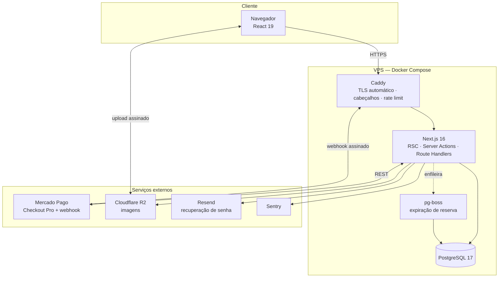

# Kolô — Escopo e Stack (TCC 2)

> **Versão:** 2.2 · **Data:** setembro de 2026 · **Fase:** TCC 2 — implementação
> **Equipe:** Caio Scorsoni, Caio Vinicius, Guilherme Salustiano, Gustavo Magalhães, Robert Estevan

Enxuga a v2.1 para caber no prazo: agendamento vira wizard → WhatsApp; o tatuador cadastra o horário depois. Itens adiados estão na [seção 14](#14-fora-de-escopo) e podem voltar depois. A numeração de RF, RN e RNF é contínua (sem buracos).

---

## Sumário

1. [Contexto](#1-contexto)
2. [Decisões de escopo](#2-decisões-de-escopo)
3. [Visão do produto](#3-visão-do-produto)
4. [Requisitos funcionais](#4-requisitos-funcionais)
5. [Requisitos não funcionais](#5-requisitos-não-funcionais)
6. [Regras de negócio](#6-regras-de-negócio)
7. [Papéis e permissões](#7-papéis-e-permissões)
8. [Stack](#8-stack)
9. [Arquitetura](#9-arquitetura)
10. [Modelo de dados](#10-modelo-de-dados)
11. [Integrações externas](#11-integrações-externas)
12. [Infraestrutura e deploy](#12-infraestrutura-e-deploy)
13. [Qualidade e testes](#13-qualidade-e-testes)
14. [Fora de escopo](#14-fora-de-escopo)

---

## 1. Contexto

O Kolô é um ateliê e estúdio de tatuagem que integra artistas plásticos, tatuadores residentes e a comunidade artística. A operação é manual: vendas controladas fora de sistema, ausência de catálogo consultável, agendamentos negociados em conversas e nenhum histórico estruturado de clientes.

O Kolô não tem mais espaço físico em Pinheiros. A plataforma web passa a ser o canal principal de exposição e venda; o agendamento começa no site e fecha no WhatsApp.

---

## 2. Decisões de escopo

| Tema | Decisão |
|------|---------|
| Objetivo primário | Entrega acadêmica. Uso real pelo cliente é bem-vindo, mas não condiciona o escopo. |
| Modelo de vendas | Loja única. O Kolô cadastra e vende as obras; repasse aos artistas é acordado fora do sistema. Estoque padrão 1, quantidade editável. |
| Visualização | Catálogo e ficha da obra em 2D (galeria + ficha técnica). Visualizador 3D adiado. |
| Pagamentos | Mercado Pago em sandbox, com código pronto para produção (troca de credenciais). |
| WhatsApp | Sem API oficial. Deep links `wa.me` com mensagem pré-preenchida. Canal de fechamento do agendamento. |
| E-mail | Só recuperação de senha. Sem e-mail transacional de pedido ou de sessão. |
| Assistente de agendamento | Wizard público, determinístico. Monta o `wa.me` e não grava solicitação. Sem LLM. Sem motor de horários livres. |
| Conformidade da tatuagem | Checks obrigatórios no wizard para liberar o WhatsApp. Anamnese, termo e identidade ficam na conversa/sessão. O sistema não armazena dado de saúde nem conferência de staff. |
| Hospedagem | VPS própria (~R$ 30–60/mês), administrada pela equipe, com Docker Compose. |
| Prazo | 8 semanas. |

---

## 3. Visão do produto

Uma aplicação web única, responsiva, com três frentes de valor:

| Vitrine pública | Área do cliente | Back-office |
|-----------------|-----------------|-------------|
| Catálogo de obras em grade 2D | Meus pedidos e rastreio | Acervo e gestão de obras |
| Ficha da obra (fotos e ficha técnica) | Um endereço de entrega | Portfólio e estilos |
| Portfólio de tatuagens | Meus dados | Artistas |
| Wizard de agendamento → WhatsApp | | Agenda (cadastro manual de horário) |
| Carrinho e checkout | | Pedidos e envios |
| Contato e políticas | | Clientes |

---

## 4. Requisitos funcionais

**Prioridade:** `P0` indispensável para a defesa · `P1` importante, entra se o P0 fechar no prazo · `P2` incremento desejável.

### 4.1 Contas e autenticação

| ID | Requisito | Prio |
|----|-----------|------|
| RF01 | Cadastro de cliente com nome, e-mail, telefone e senha | P0 |
| RF02 | Login por e-mail e senha, com sessão persistida no banco e revogável | P0 |
| RF03 | Recuperação de senha por e-mail com token de uso único e expiração | P0 |
| RF04 | Edição de perfil: dados pessoais, telefone e senha | P0 |
| RF05 | Um endereço de entrega por cliente, editável, usado no checkout | P0 |
| RF06 | Controle de acesso por papel: `CLIENTE`, `ARTISTA`, `ADMIN` | P0 |

### 4.2 Vitrine institucional

| ID | Requisito | Prio |
|----|-----------|------|
| RF07 | Home com obras em destaque e chamada para o agendamento | P0 |
| RF08 | Páginas de política de privacidade, termos de uso e política de cancelamento | P0 |

Cadastro de artista permanece no back-office (RF28) e no passo “artista” do wizard (RF20). Não há páginas públicas de artista nesta versão.

### 4.3 Catálogo

| ID | Requisito | Prio |
|----|-----------|------|
| RF09 | Catálogo de obras em grade 2D, com paginação e ordenação (recentes, preço, destaque) | P0 |
| RF10 | Página da obra com galeria de fotos e ficha técnica | P0 |

### 4.4 E-commerce

| ID | Requisito | Prio |
|----|-----------|------|
| RF11 | Carrinho persistente: mantém itens entre sessões para usuário logado, e por cookie para visitante | P0 |
| RF12 | Checkout com resumo do pedido, endereço de entrega e frete | P0 |
| RF13 | Pagamento via Mercado Pago com Pix, cartão e boleto, sem trafegar dados de cartão pelo sistema | P0 |
| RF14 | Confirmação automática do pedido ao receber a notificação de pagamento aprovado | P0 |
| RF15 | Reserva temporária das unidades da obra durante o checkout, expirando se o pagamento não for concluído | P0 |
| RF16 | Acompanhamento do pedido pelo cliente, com status e código de rastreio | P0 |

### 4.5 Portfólio de tatuagens

| ID | Requisito | Prio |
|----|-----------|------|
| RF17 | Galeria de trabalhos realizados, filtrável por artista, estilo e região do corpo | P0 |
| RF18 | Busca no portfólio por estilo e palavra-chave | P0 |
| RF19 | Gestão de fotos do portfólio pelo admin e pelo próprio artista: incluir, editar, ordenar, destacar e remover | P0 |

### 4.6 Agendamento de tatuagens

O cliente não cria agendamento no banco. O wizard só coleta dados e abre o WhatsApp. Referências de imagem o cliente envia na conversa. Depois, o artista ou o admin cadastra o horário combinado.

| ID | Requisito | Prio |
|----|-----------|------|
| RF20 | Wizard público em etapas: nome → artista → estilo → região do corpo → tamanho → data/horário (preferência, não slot travado) → checks de conformidade → redirecionamento WhatsApp. Não persiste solicitação. | P0 |
| RF21 | Conclusão do wizard abre `wa.me` com mensagem pré-preenchida: nome, artista, estilo, região, tamanho, data/horário preferidos e aceites dos checks | P0 |
| RF22 | Cadastro manual de horário pelo artista/admin (contato, artista, início/fim, observações). Sem fila de pendentes e sem motor de slots | P0 |

### 4.7 Conformidade

O sistema não coleta ficha de saúde. Anamnese, termo de consentimento informado e documento de identidade/maioridade ficam fora do software. O wizard só exige o aceite dos avisos para gerar o link do WhatsApp. Não há conferência de staff registrada no sistema nesta versão.

| ID | Requisito | Prio |
|----|-----------|------|
| RF23 | Alerta e checkbox obrigatórios: a ficha de anamnese será preenchida presencialmente | P0 |
| RF24 | Alerta e checkbox obrigatórios: o termo de consentimento será assinado presencialmente | P0 |
| RF25 | Alerta e checkbox obrigatórios de declaração de maioridade (18+) | P0 |

### 4.8 Back-office

| ID | Requisito | Prio |
|----|-----------|------|
| RF26 | CRUD de obras com múltiplas imagens, ficha técnica, preço, quantidade em estoque, situação e destaque | P0 |
| RF27 | Upload de imagens com validação de tipo e tamanho, geração de miniaturas e otimização | P0 |
| RF28 | CRUD de artistas, estilos e tags | P0 |
| RF29 | Gestão de pedidos: alterar status, registrar rastreio e ver dados de pagamento | P0 |
| RF30 | Gestão de clientes: perfil unificado com compras | P1 |
| RF31 | Configurações do site: dados de contato, horários, textos institucionais e políticas | P1 |

---

## 5. Requisitos não funcionais

### Segurança

| ID | Requisito | Verificação |
|----|-----------|-------------|
| RNF01 | Todo o tráfego em HTTPS, com certificado válido, renovação automática e redirecionamento de HTTP | SSL Labs nota A |
| RNF02 | Runtime, framework e dependências em versões com suporte ativo de segurança | `npm audit` sem vulnerabilidade alta/crítica |
| RNF03 | Senhas armazenadas apenas como hash com algoritmo de derivação lento e salt por usuário | Inspeção do banco |
| RNF04 | Prevenção de SQL Injection por consultas parametrizadas via ORM | Revisão de código + teste |
| RNF05 | Prevenção de XSS por escape automático na renderização e Content-Security-Policy restritiva | Teste manual com payloads |
| RNF06 | Proteção CSRF em todas as operações de escrita, com cookies `HttpOnly`, `Secure` e `SameSite` | Teste manual |
| RNF07 | Cabeçalhos de segurança: HSTS, X-Content-Type-Options, Referrer-Policy, X-Frame-Options | securityheaders.com nota A |
| RNF08 | Limitação de taxa em login, recuperação de senha, contato e wizard de agendamento | Teste de carga pontual |
| RNF09 | Validação de toda entrada no servidor por esquema declarado | Testes automatizados |
| RNF10 | Nenhum dado de cartão trafega ou é armazenado pelo sistema | Revisão de arquitetura |
| RNF11 | Webhooks de pagamento com verificação de assinatura e tratamento idempotente | Teste de reenvio |
| RNF12 | Segredos exclusivamente em variáveis de ambiente, nunca versionados | Varredura no repositório |

### Desempenho e disponibilidade

| ID | Requisito | Verificação |
|----|-----------|-------------|
| RNF13 | Páginas de catálogo e obra com LCP abaixo de 2,5 s em 4G simulado | Lighthouse ≥ 90 |
| RNF14 | Imagens servidas em formato moderno, com dimensões responsivas e carregamento diferido | Auditoria de rede |
| RNF15 | Disponibilidade 24/7, com reinício automático de contêiner em falha | Política de restart + monitor |
| RNF16 | Backup diário automatizado do banco, com retenção mínima de 7 dias e restauração testada | Restauração documentada |

### Privacidade e conformidade

| ID | Requisito | Verificação |
|----|-----------|-------------|
| RNF17 | Coleta limitada ao mínimo necessário, com finalidade declarada na política de privacidade | Inventário de dados |
| RNF18 | O sistema não persiste anamnese nem outras respostas clínicas | Inspeção do esquema e do banco |
| RNF19 | Exclusão de conta anonimiza o cliente preservando a integridade contábil dos pedidos | Teste funcional |

### Usabilidade e manutenção

| ID | Requisito | Verificação |
|----|-----------|-------------|
| RNF20 | Interface responsiva de 320 px a 1920 px, sem rolagem horizontal | Playwright em 3 viewports |
| RNF21 | Acessibilidade: navegação por teclado, foco visível, contraste AA e textos alternativos em imagens | axe-core sem violação crítica |
| RNF22 | Tipagem estática estrita, lint e formatação obrigatórios, com CI barrando merge em falha | Pipeline verde |
| RNF23 | Ambiente de desenvolvimento reproduzível por um único comando, com dados de exemplo | README validado por membro novo |
| RNF24 | Registro estruturado de logs e captura centralizada de exceções em produção | Erro de teste visível no painel |

---

## 6. Regras de negócio

| ID | Regra |
|----|-------|
| RN01 | Catálogo, galeria, portfólio e o wizard de agendamento são públicos. Compra e área pessoal exigem autenticação. O wizard não cria registro de agendamento. |
| RN02 | Estoque padrão igual a 1 (peça única no caso geral); a quantidade pode ser alterada pelo admin. Não se vende além do estoque disponível. |
| RN03 | Unidades em checkout são reservadas por 10 minutos; expirado o prazo sem pagamento aprovado, voltam a ficar disponíveis. |
| RN04 | A reserva de unidades é garantida por transação no banco: compras concorrentes não ultrapassam o estoque. |
| RN05 | Pedido só é considerado pago quando o gateway retorna o pagamento como aprovado. |
| RN06 | Pix e boleto geram pedido pendente; as unidades permanecem reservadas até a aprovação ou a expiração do meio de pagamento. |
| RN07 | Preços são armazenados em centavos, como inteiros, para evitar erro de ponto flutuante. |
| RN08 | Um artista não pode ter dois agendamentos sobrepostos no mesmo intervalo, restrição garantida pelo próprio banco de dados. |
| RN09 | Todos os horários são armazenados em UTC e apresentados em `America/Sao_Paulo`. |
| RN10 | Artista acessa e edita apenas o próprio portfólio, a própria agenda e os agendamentos dos quais é responsável. |
| RN11 | Obra deixa o catálogo de compra quando o estoque chega a zero; permanece visível no acervo como esgotada. |
| RN12 | Cliente exclui a própria conta, mas os pedidos pagos são preservados de forma anonimizada. |

Os checks RF23–RF25 são condição de interface para abrir o `wa.me`. Não geram persistência nem regra de cancelamento no banco.

---

## 7. Papéis e permissões

| Recurso | Visitante | Cliente | Artista | Admin |
|---------|:---------:|:-------:|:-------:|:-----:|
| Catálogo, ficha da obra, portfólio | ✓ | ✓ | ✓ | ✓ |
| Preencher o wizard e abrir WhatsApp | ✓ | ✓ | ✓ | ✓ |
| Comprar obra | — | ✓ | ✓ | ✓ |
| Ver os próprios pedidos | — | ✓ | ✓ | ✓ |
| Gerenciar o próprio portfólio e cadastrar horário na agenda | — | — | ✓ | ✓ |
| Gerenciar obras, artistas e clientes | — | — | — | ✓ |
| Gerenciar pedidos e envios | — | — | — | ✓ |
| Configurações do site | — | — | — | ✓ |

Não há “meus agendamentos” na área do cliente: o horário só existe no sistema depois do cadastro manual (RF22).

---

## 8. Stack

Uma aplicação TypeScript full-stack (monolito modular), Docker na VPS.

| Camada | Tecnologia |
|--------|------------|
| Linguagem | **TypeScript** (modo estrito) |
| Runtime | **Node.js** 24 LTS |
| Framework full-stack | **Next.js** 16 (App Router) |
| Biblioteca de UI | **React** 19 |
| Estilização | **Tailwind CSS** 4 |
| Componentes | **shadcn/ui** sobre Radix UI |
| Formulários e validação | **React Hook Form + Zod** |
| Banco | **PostgreSQL 17** |
| ORM e migrações | **Prisma 7** |
| Autenticação | **Better Auth** (e-mail e senha) |
| Pagamentos | **Mercado Pago Checkout Pro** + SDK Node oficial |
| Armazenamento de mídia | **Cloudflare R2** (compatível com S3) |
| E-mail | **Resend + React Email** (recuperação de senha) |
| WhatsApp | **Deep links `wa.me`** com mensagem pré-preenchida |
| Tarefas agendadas | **pg-boss** (fila no próprio Postgres; expiração de reserva) |
| Antibot | **Cloudflare Turnstile** |
| Testes unitários | **Vitest + Testing Library** |
| Testes de ponta a ponta | **Playwright** |
| Acessibilidade | **axe-core** integrado ao Playwright |
| Lint e formatação | **ESLint 9 + Prettier** |
| Integração contínua | **GitHub Actions** |
| Contêineres | **Docker + Docker Compose** |
| Proxy reverso e TLS | **Caddy** |
| Observabilidade | **pino + Sentry** |

---

## 9. Arquitetura

Monolito modular em contêineres, na VPS:



Organização interna por domínio:

```
src/
  app/                      # rotas (App Router)
    (site)/                 # vitrine pública: home, catálogo, portfólio, wizard
    (loja)/                 # carrinho, checkout, retorno de pagamento
    (conta)/                # área do cliente
    (admin)/                # back-office
    api/
      webhooks/mercadopago/ # Route Handler do webhook
      cron/                 # gatilhos protegidos de tarefas
  modules/
    catalog/                # obras, imagens, ordenação
    orders/                 # carrinho, pedido, frete
    payments/               # Mercado Pago, webhook, idempotência
    scheduling/             # wizard → wa.me; cadastro manual de horário
    portfolio/              # trabalhos de tatuagem
    artists/                # artistas e estilos (dado + CRUD; sem páginas públicas)
    customers/              # perfil, um endereço, exclusão LGPD
    notifications/          # recuperação de senha, links wa.me
    admin/                  # configurações
  components/ui/            # design system (shadcn/ui)
  lib/                      # db, auth, storage, env, logger, utilitários de data
prisma/schema.prisma        # contrato do modelo de dados
tests/e2e/                  # Playwright
```

---

## 10. Modelo de dados

Entidades principais:

**Identidade e pessoas**
`user` (papel, nome, e-mail, telefone, situação) · `session` · `account` (Better Auth, provedor e-mail/senha) · `verification` · `address` (no máximo um por usuário) · `artist` (vinculado a um usuário: slug, bio, avatar, Instagram, estilos — usado no CRUD, no wizard e no portfólio)

**Acervo**
`artwork` (título, slug, descrição, artista, técnica, dimensões, ano, preço em centavos, quantidade em estoque, situação: rascunho/disponível/esgotada, destaque) · `artwork_image` (URL, ordem, principal, texto alternativo) · `tag` · `artwork_tag`

**Comércio**
`cart` · `cart_item` (quantidade) · `order` (número, cliente, situação, subtotal, desconto, frete, total, endereço em cópia imutável, código de rastreio, datas) · `order_item` (cópia de título e preço; quantidade) · `payment` (provedor, id externo, método, situação, valor, payload em JSONB) · `webhook_event` (id do evento único, garantindo idempotência) · `artwork_reservation` (obra, sessão, quantidade, expiração)

**Tatuagem e agenda**
`tattoo_style` · `portfolio_item` (artista, imagem, estilos, região do corpo, duração) · `size_tier` (faixa de tamanho para o passo do wizard) · `appointment` (código; cliente `user` opcional; nome e telefone de contato; artista; situação: agendado/cancelado/concluído; início; fim; região do corpo; estilo; tamanho; descrição). Criado só pelo artista/admin (RF22). Não há `availability_rule`, `time_block` nem `appointment_reference`.

**Operação**
`site_setting` · `contact_message` · `email_log` (recuperação de senha)

Convenções: identificadores UUID; valores monetários em centavos como inteiros (RN07); datas em UTC com fuso de apresentação fixo (RN09); exclusão lógica onde houver relevância contábil; restrição de exclusão por intervalo em `appointment` (RN08); índices de busca textual em `artwork` e `portfolio_item`.

---

## 11. Integrações externas

### Mercado Pago (Checkout Pro, sandbox)

1. O cliente finaliza o carrinho; o sistema cria o pedido como pendente e reserva as unidades (RN03).
2. O servidor cria uma preferência de pagamento com os itens, as URLs de retorno, a URL de notificação e o número do pedido como referência externa.
3. O cliente é redirecionado ao checkout hospedado e paga com Pix, cartão ou boleto.
4. O Mercado Pago envia webhook para nosso Route Handler; validamos a assinatura HMAC do cabeçalho `x-signature` e respondemos rapidamente com 200.
5. Consultamos o pagamento pela API para obter a situação real — o status nunca é lido da URL de retorno do navegador (RN05).
6. Somente com pagamento aprovado o pedido é confirmado e o estoque da obra é baixado. O evento é registrado por id único, de modo que reenvios não processem duas vezes (RNF11). Não há e-mail de pedido.

### E-mail

Único template de produto nesta versão: recuperação de senha (RF03). Envio registrado em `email_log`. Sem confirmação de cadastro, status de pedido ou lembrete de sessão.

### WhatsApp

Sem API oficial. O wizard gera `https://wa.me/<numero>?text=<mensagem>` com nome, artista, estilo, região, tamanho, data/horário preferidos e aceites (RF21). Referências de imagem o cliente envia na própria conversa.

### Armazenamento de imagens

Upload direto do navegador para o R2 com URL assinada de curta duração, validando tipo e tamanho antes de emitir a assinatura. O servidor guarda apenas a chave do objeto. Entrega otimizada e responsiva pelo componente de imagem do Next.js (RNF14). Cobre obras e portfólio, não referências de agendamento.

---

## 12. Infraestrutura e deploy

**VPS mínima recomendada:** 2 vCPU, 4 GB de RAM, 40 GB SSD, Ubuntu LTS.

**Contêineres:** `caddy` (proxy reverso e TLS) · `app` (Next.js em build de produção, executando as migrações no start) · `postgres` (volume persistente) · `backup` (rotina de dump agendado).

**Publicação:** push na branch principal dispara o GitHub Actions, que roda tipagem, lint, testes e build; aprovado, conecta por SSH, atualiza o código e recria os contêineres. Rollback por tag da imagem anterior.

**Endurecimento do servidor:** acesso SSH apenas por chave, com senha e root desabilitados; firewall liberando somente 22, 80 e 443; `fail2ban`; atualizações de segurança automáticas; Postgres sem porta exposta à internet; segredos em arquivo de ambiente fora do versionamento (RNF12).

**Backup:** dump diário comprimido, enviado ao R2, com retenção de 7 dias e restauração testada ao menos uma vez e documentada (RNF16).

**Ambiente local:** `docker compose up` sobe banco e aplicação; um comando de seed popula obras, artistas, estilos e um agendamento de exemplo cadastrado pelo staff (RNF23).

---

## 13. Qualidade e testes

| Tipo | Ferramenta | O que cobre |
|------|-----------|-------------|
| Unitário | Vitest | Cálculo de total e desconto, montagem da mensagem `wa.me`, transições de status de pedido |
| Integração | Vitest + Postgres em contêiner | Reserva concorrente que não ultrapassa estoque, restrição de sobreposição de agenda no cadastro manual, idempotência do webhook |
| Ponta a ponta | Playwright | Cadastro → navegação no catálogo → compra com pagamento aprovado em sandbox → pedido confirmado; e wizard completo até o link `wa.me` |
| Responsividade | Playwright em 320, 768 e 1440 px | RNF20, com capturas de tela como evidência no documento |
| Acessibilidade | axe-core | RNF21 |
| Desempenho | Lighthouse CI | RNF13 |
| Aceitação | Roteiro assistido com o cliente | Validação com registro de feedback e ajustes |

Cada requisito funcional P0 deve ter ao menos um teste automatizado associado.

---

## 14. Fora de escopo

Itens já fora na v2.1: aplicativo móvel nativo · marketplace com contas de vendedor e divisão automática de pagamento · sala virtual navegável · tour virtual 360° · chatbot com IA conversacional · emissão de nota fiscal e integração contábil · integração com Correios em tempo real ou etiqueta de envio · controle de estoque de insumos do estúdio · múltiplos idiomas e moedas · funcionamento offline como PWA · integração com maquininha ou ponto de venda físico · assinatura ou clube de membros · ficha de anamnese digital e armazenamento de dados de saúde · termo de consentimento com valor jurídico no sistema · cupons de desconto · recomendações personalizadas · lista de desejos / favoritos · exportação de dados em CSV · verificação de e-mail no cadastro · cobrança de sinal para agendamento · remarcação e cancelamento pelo cliente · registro de comparecimento · estimativa automática de duração e valor · uso de imagem no portfólio · log de auditoria · múltiplas salas/exposições temáticas · curadoria de paredes/salas pelo administrador.

Adiado na v2.2 (pode voltar depois): login social com Google · listagem e página pública do artista · filtros do catálogo · visualizador 3D na ficha da obra, WebGL e fallback 2D · e-mail transacional de pedido e demais e-mails além da recuperação de senha · upload de referências no wizard · motor de horários livres, disponibilidade semanal e bloqueios · fluxo de aprovação da solicitação · Google Calendar · lembrete automático por e-mail · dashboard de faturamento · múltiplos endereços de entrega · “meus agendamentos” na área do cliente · persistência da solicitação do wizard · conferência presencial de anamnese/termo/identidade registrada no sistema · política de cancelamento aplicada pelo software.
